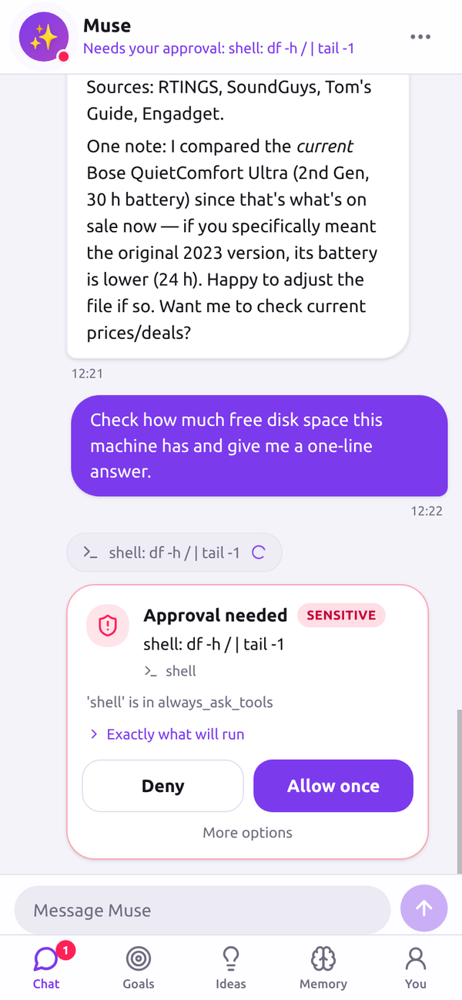
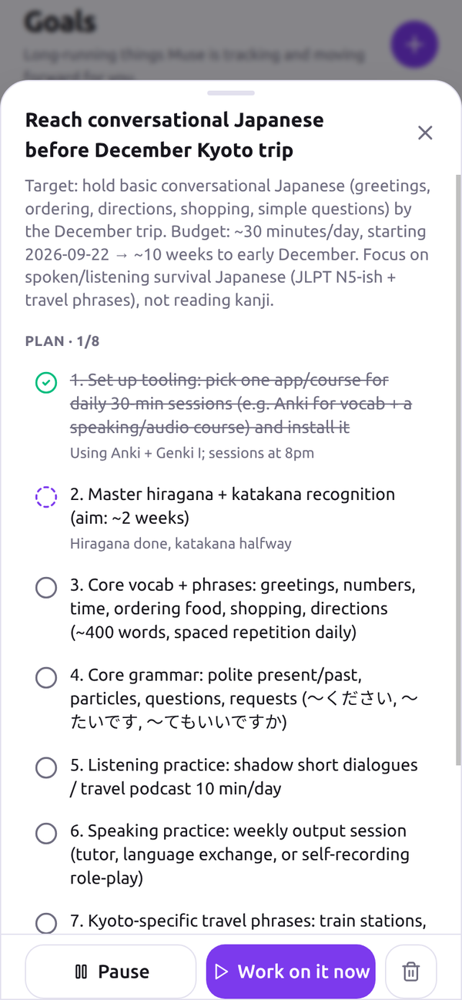
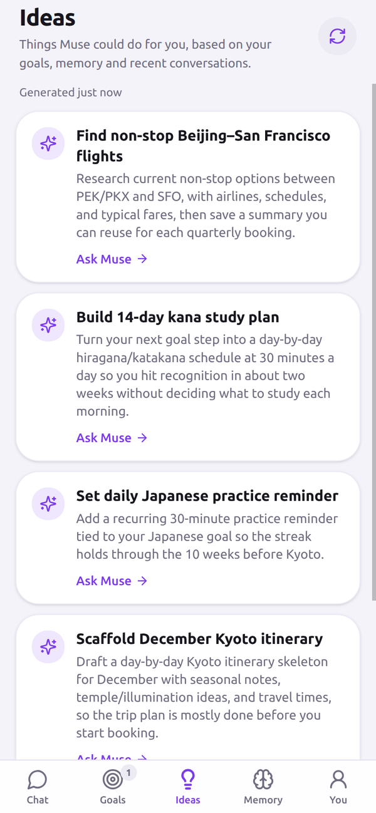
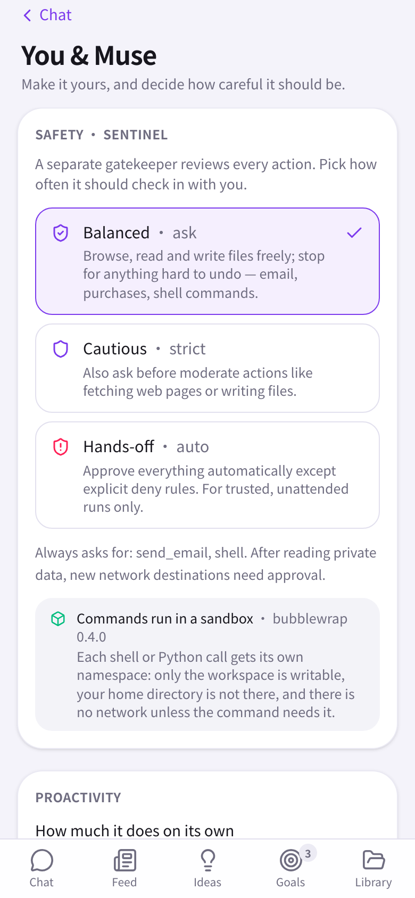
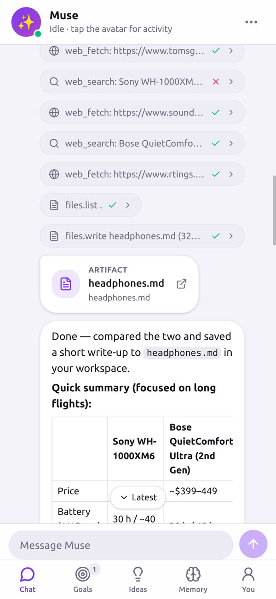
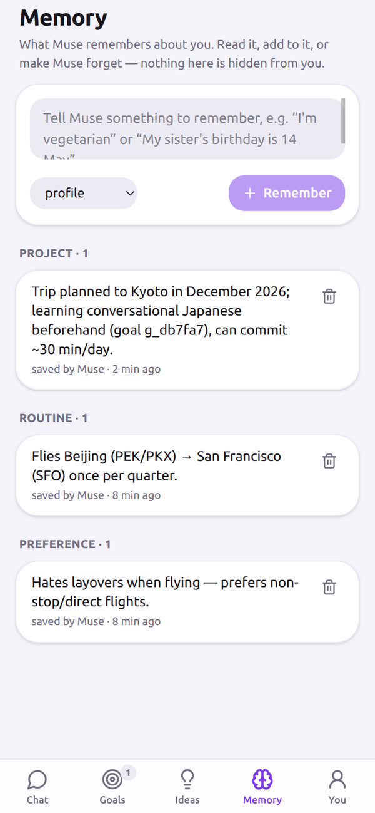
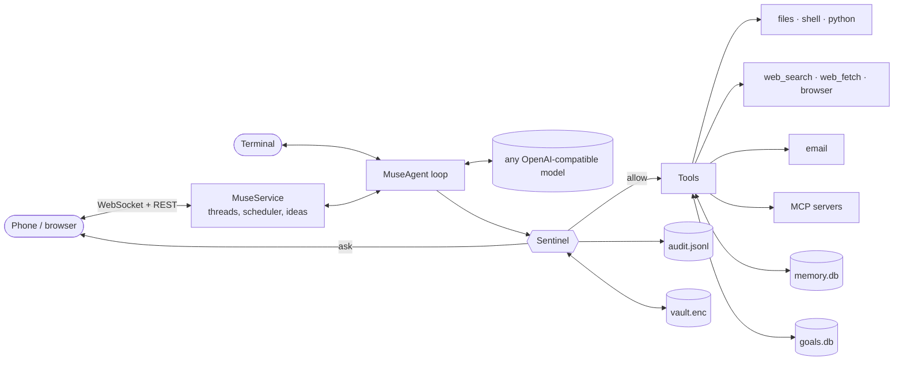

<p align="center">
  
</p>

<h1 align="center">OpenMuse</h1>

<p align="center">
  An open-source version of Meta's <a href="https://about.fb.com/news/2026/09/introducing-muse-personal-ai-agent/">Muse</a>: a personal agent that works for you from your phone, keeps going while the app is closed, and asks before it does anything you can't undo. Self-hosted, any model.
</p>

<p align="center">
  <a href="https://github.com/OpenMuseAgent/OpenMuse/actions/workflows/ci.yml"></a>
  <a href="https://pypi.org/project/openmuse/"></a>
  <a href="LICENSE"></a>
  
  <br>
  English · <a href="README_zh.md">简体中文</a>
</p>

<p align="center">
  
</p>
<p align="center">
  <sub>One task, start to finish: <em>"Make me a packing list for 4 days in Kyoto… then commit it to my kyoto-notes repo."</em> The agent finds the repo, stops once before its first <code>git</code> command — approved <em>for this task</em>, so the commit later needs no second tap — writes a page you can tick off, commits it, and the reply links the file. A real run on DeepSeek V4.1 Flash, 52 s; the wait in the middle is cut.</sub>
</p>

<p align="center">
  
  
  
  
</p>

## Start here

| You want to... | Go to |
|---|---|
| Install and open the app on your phone | [Install](#install) → [Quick start](#quick-start) |
| Use it from the terminal instead | [CLI](docs/cli.md) |
| Point it at DeepSeek, OpenAI, Ollama, or an internal gateway | [Models](#models) · [Configuration](docs/configuration.md) |
| Understand what it will and won't do without asking | [Sentinel](#sentinel) · [docs/sentinel.md](docs/sentinel.md) |
| Connect email, a browser, or MCP servers | [Configuration → Connectors](docs/configuration.md#connectors) |
| Read the code | [Architecture](#architecture) · [docs/architecture.md](docs/architecture.md) |
| Run it in Docker | [Deployment](docs/deployment.md) |
| See it as an app on a (simulated) phone, notifications included | [demo/mobilegym](demo/mobilegym/README.md) |

## What it does

Meta's Muse is an agent that does things rather than answering questions: it researches, plans, writes files, sends mail, works on goals over weeks, and every risky action passes through a separate gatekeeper. OpenMuse rebuilds that shape in the open:

- One long conversation with your agent, plus side chats for separate tasks. Tool calls show up inline as chips you can expand.
- Approval cards. Anything hard to undo (a shell command, an email, a network call after reading private data) stops and waits for a tap. An approval is scoped — once, this task, until restart, 24 hours, always — and bound to what it was for: `git` commands, email to one address, one website. Every permission you granted is listed under the avatar and can be revoked on its own.
- Goals that outlive the chat. The agent breaks a goal into steps, updates them as it works, and can keep advancing goals on a timer while the app is closed, posting updates to the main chat.
- Ideas: suggested next actions based on your goals, memory and recent conversations.
- Memory you can read and edit. Durable facts about you are saved by the agent and shown in a tab; anything can be forgotten with one tap. When a fact changes, the line is updated rather than doubled, and a periodic tidy-up merges what says the same thing and drops what was never a fact — every change listed with an undo.
- A Sentinel, a credential vault, taint tracking and an append-only audit log. See [Sentinel](#sentinel).
- Tools: files, shell, Python, web search and fetch, email (with one-time codes scrubbed before the model sees them), an optional Playwright browser, and any [MCP](https://modelcontextprotocol.io) server.
- Runs on any OpenAI-compatible model. DeepSeek, OpenAI, OpenRouter, Ollama, vLLM, or a company gateway with custom headers.

## Why OpenMuse

- **It is a Muse, not a bot framework.** One agent with a name and a face, a phone app with Chat / Feed / Ideas / Goals / Library tabs, approval cards, background work. If you want a bot in Telegram or Discord, see [Related projects](#related-projects).
- **Safety is the architecture, not a setting.** The agent never touches tools directly. A separate `Sentinel` decides allow / ask / deny per call, resolves `{{vault:NAME}}` placeholders so secrets never reach the model, tracks taint (private data read → new destinations need approval), and logs everything.
- **Bring your own model.** Chat Completions or Responses API, streaming, `<think>` handling, native or prompt-based tool calling.
- **Small enough to read.** About 7k lines of typed Python and 3k lines of TypeScript. No orchestration framework underneath.

## Install

Python 3.11 or newer. The phone app is pre-built and included in the package; Node is only needed if you change `web/`.

```bash
uv tool install openmuse
# or: pip install openmuse
```

Latest from git: `uv tool install git+https://github.com/OpenMuseAgent/OpenMuse.git`. From a checkout, for development:

```bash
git clone https://github.com/OpenMuseAgent/OpenMuse.git && cd OpenMuse
uv venv && source .venv/bin/activate
uv pip install -e ".[dev]"
```

Optional: `openmuse[browser]` adds the Playwright browser tool (then `playwright install chromium`).

## Quick start

```bash
openmuse config init                 # writes config/config.toml
export DEEPSEEK_API_KEY=sk-...       # the default config uses DeepSeek; see Models below
openmuse serve --host 0.0.0.0        # prints a URL and a QR code
```

Scan the QR code with your phone (same Wi-Fi), or open the URL on this machine. The link carries a one-time access token; add the page to your home screen and it behaves like an app. Then try:

- *"Compare the Sony WH-1000XM6 and Bose QuietComfort Ultra for long flights and save a short comparison to headphones.md"*
- *"Check how much free disk space this machine has"* — this one produces an approval card.
- *"Set up a goal: conversational Japanese before my Kyoto trip in December, 30 minutes a day"* — then open the Goals tab.

Prefer a terminal? `openmuse chat` gives you the same agent with approvals in the console, and `openmuse run "task"` runs one task and exits. Something off? `openmuse doctor` checks the config, the model and the connectors and says what to fix. See [docs/cli.md](docs/cli.md).

## The app

`openmuse serve` starts an always-on agent and serves a mobile-first web app from the same process (FastAPI + a WebSocket for live events; React on the client, bundled into the Python package).

<p align="center">
  
  
  
  
</p>

| Screen | What you get |
|---|---|
| Chat | Message-style conversation, streaming replies, tool chips with output, file artifacts (a file named in a reply opens on tap), approval and question cards, side chats. You can keep typing while the agent works; new messages are folded into the running turn. When it browses, a live browser card shows the page after every step — tap it to watch, *take over* to sign in or fix something yourself, hand it back and the agent continues. |
| Feed | What happened while you were away: the result of each background pass, files it made, and every card still waiting for you, from any chat. *Next up* says what runs next. |
| Ideas | Five suggested actions, regenerated on demand. Tap one to send it as a message. |
| Goals | Goals by area of life (health, finance, career, learning…), each with a plan, step status and notes, a target date and an optional check-in cadence — a short message at that time, nothing more. When what the agent learns no longer fits the plan it proposes a change and you accept or keep yours. A proactivity dial (Off / Low / Default / High) and quiet hours decide how often it works on goals while you are away and when it speaks up — a pass with nothing to report stays a one-liner instead of a message. |
| Reminders | "Remind me at six to call mum" — one message at that time, in the chat you said it in. "Every weekday at 07:30, a one-line weather check for my ride" — a routine: the agent does the work then and reports. Kept whatever the proactivity level or quiet hours; listed under *Upcoming* and in the terminal. |
| Library | Everything the agent made — pages, documents, trackers, images — opened in the app. Pages render in a sandbox that cannot reach your token or the API. |
| Avatar | The menu: the approvals queue across all chats, the activity log, permissions you granted (revoke any one), what is upcoming (background work, check-ins, reminders), memory, connections, and settings (name, avatar, personality, Sentinel mode, background work, language). |
| Connections | Plug things in from the phone: the model (provider presets, key straight into the vault, one-tap test), your mailbox (read and send, with a sign-in check), the browser, MCP servers, and the vault itself. Keys and passwords never reach the model. |

The first time you open it, a short setup runs instead: your name, your Muse's name and style, the model and key, optionally your mail. Skip it if `config.toml` already says it all.

Add it to the home screen and turn on notifications (Settings): the phone buzzes when the agent needs an approval, has a question, finished something in the background, or a reminder or check-in is due — standard Web Push through the browser, no account with anyone — and the icon shows how many cards are waiting. Needs `https://` or `localhost`; see [deployment](docs/deployment.md).

The app talks to a small REST + WebSocket API, documented in [docs/app.md](docs/app.md), so other front-ends can be built on the same server.

To see it the way Muse is meant to be seen — an app among other apps, coming through the notification shade when it needs you — [demo/mobilegym](demo/mobilegym/README.md) installs OpenMuse as a native app on [MobileGym](https://github.com/Purewhiter/mobilegym), a browser-hosted Android simulator. One browser tab, no device.

## Sentinel

Every tool call goes through `Sentinel` before it runs. Tools declare a risk level (`safe` / `moderate` / `sensitive`) and can escalate a specific call (`shell` on `rm -rf`, `python_execute` when the code reaches the network or the environment, `web_fetch` on a private IP — including through redirects). Evaluation order, first match wins:

1. `deny_tools` → deny
2. `[[sentinel.rules]]` matching glob patterns on the arguments → the rule's action
3. `always_allow_tools` / `always_ask_tools`
4. Taint: the session has read private data (email, memories, files outside the workspace) **and** this call sends data to a host outside `egress_allowlist` → ask
5. Risk × mode: `ask` asks for sensitive calls, `strict` also for moderate ones, `auto` allows everything not denied
6. A call with a warning (`sudo`, `curl | sh`, code that deletes files) asks regardless of mode; only an explicit rule can allow it

```toml
[sentinel]
mode = "ask"                              # ask | strict | auto
always_ask_tools = ["send_email", "shell"]
egress_allowlist = ["*.wikipedia.org", "github.com", "*.github.com"]

[[sentinel.rules]]
tool   = "shell"
match  = { command = "*rm -rf*" }
action = "deny"
```

Secrets live in a Fernet-encrypted vault (`openmuse vault set EMAIL_PASSWORD`, or the Connections screen). Config and tool arguments reference them as `{{vault:EMAIL_PASSWORD}}`; Sentinel substitutes the value right before execution and redacts it from tool output, so the model never sees it. Shell commands and Python scripts run with credential-looking environment variables stripped. Every decision is appended to `~/.openmuse/audit.jsonl`. Details, and an honest list of what is *not* covered, in [docs/sentinel.md](docs/sentinel.md); reporting in [SECURITY.md](SECURITY.md).

## Models

Edit `[llm]` in `config/config.toml`. Any OpenAI-compatible endpoint works:

```toml
[llm]
provider = "openai"                    # Chat Completions; "openai_responses" for the Responses API
model    = "deepseek-flash"
base_url = "https://api.deepseek.com"
api_key  = "${DEEPSEEK_API_KEY}"

# OpenAI:      model = "gpt-5.6-sol"  base_url = "https://api.openai.com/v1"   api_key = "${OPENAI_API_KEY}"
# Ollama:      model = "qwen3:8b"     base_url = "http://localhost:11434/v1"   api_key = "ollama"
# OpenRouter:  model = "deepseek/deepseek-flash"  base_url = "https://openrouter.ai/api/v1"
# A gateway that needs headers:  extra_headers = { "X-End-User-Id" = "openmuse" }
# An endpoint that silently ignores `tools`:  tool_mode = "prompt"   (rejections are handled by the default "auto")
```

The same settings can be set with `OPENMUSE_LLM_MODEL`, `OPENMUSE_LLM_BASE_URL`, `OPENMUSE_LLM_API_KEY`, `OPENMUSE_LLM_PROVIDER`. Full reference: [docs/configuration.md](docs/configuration.md).

Local models work: `qwen3:8b` on Ollama passes the [provider check](scripts/provider_check.py) (five everyday tasks) with native tool calling, `gemma3:4b` through the prompt fallback. Results and settings in [docs/configuration.md → Local models](docs/configuration.md#local-models); `python scripts/provider_check.py` tells you about yours in a minute.

## Architecture



| Area | Files |
|---|---|
| Agent loop, system prompt, context window | `openmuse/agent/core.py`, `openmuse/prompts.py` |
| Sentinel: policy, approvals, taint, audit | `openmuse/sentinel/` |
| Credential vault | `openmuse/vault/` |
| Tools and MCP adapter | `openmuse/tools/` |
| LLM providers, `<think>` filter, prompt-based tool calling | `openmuse/llm/` |
| Memory and goals (SQLite) | `openmuse/memory/`, `openmuse/goals/` |
| App server: service, REST/WebSocket API, timeline | `openmuse/server/` |
| Phone app (React, Vite, Tailwind) | `web/` → built into `openmuse/server/static/` |
| Terminal UI and CLI | `openmuse/console.py`, `openmuse/cli.py` |

More in [docs/architecture.md](docs/architecture.md).

## OpenMuse and Meta Muse

| Meta Muse | OpenMuse |
|---|---|
| Runs in a per-user Secure VM | Runs on your machine or in Docker; the workspace and data directory are the boundary |
| Sentinel approves sensitive actions | `Sentinel` policy engine: allow / ask / deny, rules, taint tracking, egress allowlist |
| Credentials never reach the model | Encrypted vault with `{{vault:NAME}}` placeholders and output redaction |
| Remembers you | SQLite memory the agent maintains and you can edit |
| Works on goals in the background | Goals with steps; scheduler advances them and reports to the chat |
| Mobile app with chat, goals, approvals | Mobile-first web app served by `openmuse serve`, installable to the home screen |
| Meta's models | Any OpenAI-compatible model |
| Closed | MIT |

## Docs

- [Configuration](docs/configuration.md): every setting, environment overrides, connectors, MCP
- [Sentinel](docs/sentinel.md): policy order, rules, taint tracking, vault, audit
- [The app and its API](docs/app.md): phone access, tokens, threads, approvals, endpoints
- [CLI](docs/cli.md): `chat`, `run`, `serve`, `daemon`, `goals`, `memory`, `vault`, `audit`, `config`
- [Architecture](docs/architecture.md): source map and extension points
- [Deployment](docs/deployment.md): Docker, Compose, keeping it running
- [Troubleshooting](docs/troubleshooting.md)

## Roadmap

- [x] Agent loop, Sentinel, vault, audit, memory, goals, tools, MCP, CLI
- [x] Mobile-first app: Chat · Feed · Ideas · Goals · Library, approvals as scoped grants, side chats, background goal work
- [x] Push notifications when an approval is waiting or a goal posts an update
- [x] Browser view: watch the agent browse live, take over for sign-ins
- [x] Local models (Ollama) with automatic prompt-mode fallback
- [ ] Triggers for goals: cron, webhooks, new mail
- [ ] Calendar and contacts connectors (via MCP)
- [x] Memory that stays tidy: rare-word recall, updates instead of duplicates, a periodic tidy-up with undo
- [ ] Memory recall with embeddings
- [ ] Per-tool sandboxes for `shell` and `python_execute`
- [ ] Skills: reusable task recipes
- [x] The app in 简体中文 (Settings → App language); more languages welcome — one dictionary file each

## Contributing

Use it for a real task, report what broke, then pick something focused. [CONTRIBUTING.md](CONTRIBUTING.md) has the development setup; CI runs `ruff`, `pytest` and the web build.

## Related projects

- [nanobot](https://github.com/HKUDS/nanobot): a lightweight personal assistant framework that lives in chat apps (Telegram, Discord, Slack, WeChat...). Pick it if you want a bot in the channels you already use. OpenMuse is one agent with Muse's product shape and safety model; it does not try to be a channel framework.
- [OpenClaw](https://github.com/openclaw/openclaw): the always-on gateway approach many assistant projects follow.
- [browser-use](https://github.com/browser-use/browser-use): the element-annotation idea behind the browser tool.
- [Model Context Protocol](https://modelcontextprotocol.io): how OpenMuse gets connectors without writing each one.

## Disclaimer

OpenMuse is an independent community project. It is not affiliated with, endorsed by, or derived from Meta Platforms, Inc. or its Muse product.

## License

[MIT](LICENSE)
