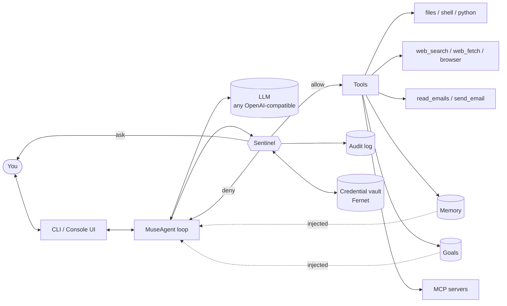

<p align="center">
  <h1 align="center">OpenMuse</h1>
  <p align="center">
    An open-source personal AI agent in the spirit of Meta's <b>Muse</b> — with a <b>Sentinel</b> gatekeeper, an encrypted credential vault, approvals, an audit trail, long-term memory and goals.<br/>
    Bring your own model.
  </p>
</p>

<p align="center">
  <a href="https://github.com/OpenMuseAgent/OpenMuse/actions/workflows/ci.yml"></a>
  <a href="LICENSE"></a>
  
  <a href="README_zh.md">中文文档</a>
</p>

---

**OpenMuse is to Meta Muse what OpenManus is to Manus**: a community reimplementation of the *ideas* behind a closed product. Muse's pitch is an agent that does real things for you — reads your mail, browses, runs code, remembers you and pursues goals over days — while staying safe because every action passes through a gatekeeper and your credentials never touch the model. OpenMuse implements that architecture in ~5k lines of typed Python you can read in an afternoon, and runs against **any OpenAI-compatible model**: DeepSeek, OpenAI, Anthropic, OpenRouter, Ollama, vLLM or your company's internal gateway.

> Status: **v0.1.0 — alpha**. The core loop, Sentinel, vault, memory, goals, tools and CLI work end-to-end; APIs may still change.

## Features

| | |
|---|---|
| 🛡️ **Sentinel gatekeeper** | Every tool call is mediated by a policy engine: `allow` / `ask` / `deny`, three modes (`ask`, `strict`, `auto`), per-tool risk levels, glob rules on arguments, session or persistent approvals. |
| 🧪 **Taint tracking + egress allowlist** | Once the agent has touched private data (mail, memories, files outside the workspace) the session is *tainted* and any network egress to a host outside your allowlist needs explicit approval — a practical defence against prompt-injection exfiltration. |
| 🔐 **Credential vault** | Fernet-encrypted secret store. Config and tools reference `{{vault:NAME}}`; Sentinel resolves the placeholder at execution time, so the model never sees the value, and outputs are redacted. |
| 📜 **Audit trail** | Append-only JSONL of every decision, approval, tool call and result. `openmuse audit`. |
| 🧠 **Memory** | `remember` / `recall` / `forget` backed by SQLite; relevant memories are injected into the system prompt. |
| 🎯 **Goals + daemon** | Multi-step, long-horizon goals with plans, progress and notes. `openmuse daemon` keeps advancing active goals unattended (Sentinel `auto` mode + deny rules). |
| 🧰 **Tools & MCP** | Files (workspace-scoped), shell, Python, web search / fetch (SSRF-safe), email, browser — plus any [Model Context Protocol](https://modelcontextprotocol.io) server over stdio / HTTP / SSE. |
| ✉️ **Email connector with OTP scrubbing** | IMAP/SMTP via vault credentials. One-time codes and reset links are stripped *before* the model reads a mail. |
| 🌐 **Optional Playwright browser** | `pip install "openmuse[browser]"` for navigate / extract / click / type / screenshot. |
| 🔌 **Any model** | Chat Completions or Responses API, streaming, `<think>` handling, native or prompt-based tool calling, `extra_headers` / `extra_body` for gateways. |

## Architecture



* **MuseAgent** – a think → act loop with context trimming, stuck detection and session persistence (`openmuse/agent/core.py`).
* **Sentinel** – `Policy` (rules, risk × mode, taint) + `AuditLog` + approvals + vault resolution (`openmuse/sentinel/`).
* **Vault** – `CredentialVault` with `{{vault:NAME}}` resolution and output redaction (`openmuse/vault/`).
* **Tools** – `BaseTool` with static `risk` and dynamic `assess()` (e.g. `shell` escalates on `rm -rf`, `web_fetch` blocks private IPs) (`openmuse/tools/`).
* **LLM** – `OpenAIChatLLM`, `OpenAIResponsesLLM`, `PromptToolAdapter` fallback, `MockLLM` for tests (`openmuse/llm/`).

### How it compares to Meta Muse

| Meta Muse | OpenMuse |
|---|---|
| Runs in a *Secure VM* | Run it in Docker (`docker compose run muse`) or any sandbox you like |
| *Sentinel* approves sensitive actions | `Sentinel` policy engine: allow / ask / deny, taint tracking, egress allowlist |
| Credentials isolated from the model | Encrypted vault + `{{vault:NAME}}` placeholders, never in prompts |
| Remembers preferences | SQLite memory with `remember` / `recall` / `forget` |
| Works on long tasks in the background | `goals` store + `openmuse daemon` |
| Connects to mail, calendar, browser | Email (IMAP/SMTP), Playwright browser, anything via MCP |
| Meta's models only | Any OpenAI-compatible endpoint, local models included |
| Closed source | MIT |

## Quick start

```bash
# 1. install (Python 3.11+)
uv pip install openmuse            # or: pip install openmuse
# from source:
git clone https://github.com/OpenMuseAgent/OpenMuse.git && cd OpenMuse
uv venv && source .venv/bin/activate && uv pip install -e ".[dev]"

# 2. create a config and point it at a model
openmuse config init               # writes config/config.toml
export DEEPSEEK_API_KEY=sk-...     # default config uses DeepSeek

# 3. talk to your agent
openmuse chat
openmuse run "Summarise the top 3 Hacker News stories into workspace/hn.md"
```

The config file is searched in this order: `--config PATH`, `$OPENMUSE_CONFIG`, `./config/config.toml`, `~/.openmuse/config.toml`. String values may contain `${ENV_VAR}` or `${ENV_VAR:-default}`.

### Choosing a model

Any OpenAI-compatible endpoint works. Edit `[llm]` in `config/config.toml`:

```toml
[llm]
# DeepSeek (default)
provider = "openai"                # Chat Completions API
model    = "deepseek-flash"
base_url = "https://api.deepseek.com"
api_key  = "${DEEPSEEK_API_KEY}"

# OpenAI
# model = "gpt-5.6-sol"          base_url = "https://api.openai.com/v1"   api_key = "${OPENAI_API_KEY}"

# Ollama / vLLM / LM Studio (fully local, private)
# model = "qwen3:32b"          base_url = "http://localhost:11434/v1"  api_key = "ollama"

# OpenRouter
# model = "deepseek/deepseek-flash"  base_url = "https://openrouter.ai/api/v1"  api_key = "${OPENROUTER_API_KEY}"

# Any gateway that needs extra headers / body fields
# base_url      = "https://gateway.example.com/v1"
# extra_headers = { "X-End-User-Id" = "openmuse" }
# extra_body    = { "thinking" = { "type" = "enabled" } }
# provider      = "openai_responses"   # if the gateway speaks the Responses API instead
# tool_mode     = "prompt"             # if the endpoint ignores `tools` (tools are described in the prompt instead)
```

Quick overrides without touching the file: `OPENMUSE_LLM_MODEL`, `OPENMUSE_LLM_BASE_URL`, `OPENMUSE_LLM_API_KEY`, `OPENMUSE_LLM_PROVIDER`, `OPENMUSE_LLM_TOOL_MODE`, `OPENMUSE_SENTINEL_MODE`, `OPENMUSE_DATA_DIR`, `OPENMUSE_LOG_LEVEL` (see [`.env.example`](.env.example)).

## CLI

```text
openmuse chat  [--auto] [--show-thinking] [--resume]   interactive session (/help, /memory, /goals, /audit, /tools, /tainted, /reset)
openmuse run   "task"  [--auto]                         one-shot task
openmuse daemon [--interval 3600] [--once]              keep advancing active goals (Sentinel auto mode)

openmuse goals   list|show|add|run|status|delete
openmuse memory  list|add|forget|clear
openmuse vault   set|list|delete                        secrets the model never sees
openmuse audit   [-n 20] [--json]                       recent audit entries
openmuse config  init|show|path
openmuse version
```

All commands accept `--config PATH`. `--auto` switches Sentinel to `auto` mode for the run (explicit `deny` rules still apply).

## Sentinel

Sentinel sits between the agent and every tool. Each tool declares a static risk level (`safe` / `moderate` / `sensitive`) and may escalate it dynamically per call. The policy is evaluated in this order — first match wins:

1. `deny_tools` → **deny**
2. `[[sentinel.rules]]` with matching glob patterns on arguments → rule's `action`
3. `always_allow_tools` / `always_ask_tools`
4. Taint: session has read private data **and** the call sends data to a host not in `egress_allowlist` → **ask**
5. Risk × mode: `ask` mode asks for `sensitive`; `strict` asks for `moderate` and `sensitive`; `auto` allows everything

```toml
[sentinel]
mode = "ask"                              # ask | strict | auto
always_ask_tools   = ["send_email", "shell"]
deny_tools         = []
taint_tracking     = true
egress_allowlist   = ["duckduckgo.com", "*.duckduckgo.com", "*.wikipedia.org", "github.com", "*.github.com"]

[[sentinel.rules]]                        # first match wins; values are glob patterns
tool   = "shell"
match  = { command = "*rm -rf*" }
action = "deny"
reason = "recursive deletes are not allowed"

[[sentinel.rules]]
tool   = "files"
match  = { action = "write", path = "*.env" }
action = "ask"
```

When Sentinel asks, you can approve **once**, for the **session**, or **always** (persisted). Every decision lands in `~/.openmuse/audit.jsonl`.

## Credential vault

```bash
openmuse vault set EMAIL_PASSWORD          # prompted, stored Fernet-encrypted in ~/.openmuse/vault.enc
openmuse vault list                        # names only
```

```toml
[connectors.email]
enabled  = true
address  = "{{vault:EMAIL_ADDRESS}}"
password = "{{vault:EMAIL_PASSWORD}}"
```

Placeholders are resolved by Sentinel right before a tool executes. The model only ever sees `{{vault:EMAIL_PASSWORD}}`; if a secret value leaks into a tool result it is redacted before the model reads it. The key lives in `~/.openmuse/vault.key` or `$OPENMUSE_VAULT_KEY`.

## Memory and goals

```bash
openmuse memory add "I prefer concise answers in English" --category preference
openmuse goals add "Learn Rust" -s "Read the book ch.1-4" -s "Build a CLI" -s "Publish a crate"
openmuse goals run g_xxxx               # advance one goal now
openmuse daemon --interval 1800         # advance all active goals every 30 min
```

The agent also manages memory (`remember` / `recall` / `forget`) and goals (`goals` tool) on its own during conversations. `recall` and `read_emails` mark the session as tainted.

## Tools

| Tool | Risk | Notes |
|---|---|---|
| `files` | safe | read / write / append / list / search, confined to `agent.workspace` |
| `shell` | sensitive | dangerous patterns escalate; `always_ask_tools` by default |
| `python_execute` | moderate | subprocess with timeout |
| `web_search` | safe | DuckDuckGo |
| `web_fetch` | moderate | HTML → Markdown, blocks private / loopback hosts |
| `read_emails` / `send_email` | moderate / sensitive | IMAP / SMTP, OTP + reset-link scrubbing |
| `browser` | moderate | optional Playwright |
| `remember` / `recall` / `forget` | safe / safe / moderate | long-term memory |
| `goals` | safe | create / list / update steps / notes |
| `ask_user`, `terminate` | safe | control flow |
| MCP tools | configurable | risk level per server |

### MCP servers

```toml
[[mcp.servers]]
name = "filesystem"
command = "npx"
args = ["-y", "@modelcontextprotocol/server-filesystem", "./workspace"]
risk = "moderate"

[[mcp.servers]]
name = "calendar"
url = "http://localhost:8000/mcp"      # streamable HTTP, falls back to SSE automatically
risk = "sensitive"
reads_private_data = true
```

Remote tools appear as `<server>__<tool>` and go through Sentinel like everything else.

## Docker (the "Secure VM")

```bash
cp .env.example .env && $EDITOR .env
docker compose run --rm muse                      # interactive chat
docker compose run --rm muse run "plan my week"   # one-shot
docker compose up daemon                          # background goal runner
```

State (`/data`) and the agent's files (`/workspace`) are volumes; the container runs as a non-root user with no host access beyond those mounts.

## Development

```bash
uv pip install -e ".[dev]"
ruff check openmuse tests && ruff format --check openmuse tests
python -m pytest -q                       # unit tests, MockLLM, no network
OPENMUSE_LIVE=1 python -m pytest -q -m live   # smoke test against your configured model
```

See [CONTRIBUTING.md](CONTRIBUTING.md).

### Troubleshooting

* **Beginning of replies missing when streaming** (e.g. "帮你写作…" instead of "你好！我能帮你写作…"). Some proxies that inline `<think>…</think>` into `content` drop the first tokens after `</think>` *on the server side* when streaming; non-streaming responses are complete. Set `stream = false` under `[llm]`.
* **Model ignores tools.** Set `tool_mode = "prompt"` — tools are described in the system prompt and parsed from `<tool_call>` blocks.
* **429 / rate limits.** Requests retry with exponential back-off (`max_retries`, default 5). Lower `max_steps` or add `web_fetch` to `always_ask_tools` to slow the loop down.

## Roadmap

- [ ] Web UI (approvals on your phone) and Telegram / Slack front-ends
- [ ] Scheduled triggers for goals (cron, webhooks, new-mail events)
- [ ] Calendar and contacts connectors (via MCP)
- [ ] Vector-based memory recall, memory consolidation
- [ ] Planner / sub-agent delegation for long goals
- [ ] Per-tool sandboxes (gVisor / Firecracker) for `shell` and `python_execute`
- [ ] Skills: reusable, shareable task recipes

## Acknowledgements

* [OpenManus](https://github.com/FoundationAgents/OpenManus) – for showing what an open reimplementation of a hot closed agent can look like; the agent/tool loop here follows its shape.
* [browser-use](https://github.com/browser-use/browser-use) – inspiration for the browser tool's element annotation.
* [Model Context Protocol](https://modelcontextprotocol.io) – so we don't have to write every connector ourselves.
* Meta's Muse – for the Sentinel / vault / secure-VM architecture that OpenMuse re-creates in the open.

## Disclaimer

OpenMuse is an independent community project. It is not affiliated with, endorsed by, or derived from Meta Platforms, Inc. or its Muse product. "Muse" is used descriptively.

## License

[MIT](LICENSE)
