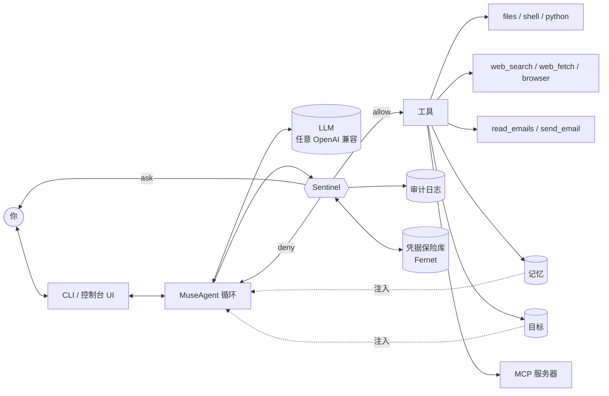

<p align="center">
  <h1 align="center">OpenMuse</h1>
  <p align="center">
    Meta <b>Muse</b> 的开源复现：一个带 <b>Sentinel 守门人</b>、加密凭据保险库、审批、审计日志、长期记忆与目标的个人 AI Agent。<br/>
    模型自带，任意 OpenAI 兼容接口皆可。
  </p>
</p>

<p align="center">
  <a href="https://github.com/OpenMuseAgent/OpenMuse/actions/workflows/ci.yml"></a>
  <a href="LICENSE"></a>
  
  <a href="README.md">English</a>
</p>

---

**OpenMuse 之于 Meta Muse，正如 OpenManus 之于 Manus**：对一个闭源产品背后*理念*的社区复现。Muse 的卖点是一个真正替你做事的 Agent——读邮件、上网、跑代码、记住你的偏好、跨越数天推进目标——同时保持安全：每个动作都要经过守门人，凭据永远不进模型。OpenMuse 用约 5k 行带类型标注的 Python 实现了这套架构，一个下午就能读完，并且可以接 **任何 OpenAI 兼容模型**：DeepSeek、OpenAI、Anthropic、OpenRouter、Ollama、vLLM 或公司内部网关。

> 状态：**v0.1.0 — alpha**。核心循环、Sentinel、保险库、记忆、目标、工具和 CLI 已可端到端运行；API 仍可能变动。

## 特性

| | |
|---|---|
| 🛡️ **Sentinel 守门人** | 所有工具调用都经策略引擎裁决：`allow` / `ask` / `deny`，三种模式（`ask`、`strict`、`auto`），按工具的风险等级、对参数的 glob 规则，会话级或持久化审批。 |
| 🧪 **污点追踪 + 出站白名单** | 一旦 Agent 接触过私密数据（邮件、记忆、工作区外文件），会话即被标记为 *tainted*，此后对白名单之外主机的任何网络出站都需要明确审批——这是对提示注入导致数据外泄的实用防线。 |
| 🔐 **凭据保险库** | Fernet 加密的密钥存储。配置和工具里写 `{{vault:NAME}}`，Sentinel 在执行前解析占位符，模型永远看不到真实值，输出中也会被脱敏。 |
| 📜 **审计日志** | 只追加的 JSONL，记录每次裁决、审批、工具调用与结果。`openmuse audit`。 |
| 🧠 **记忆** | SQLite 支撑的 `remember` / `recall` / `forget`，相关记忆自动注入系统提示。 |
| 🎯 **目标 + 守护进程** | 多步骤长周期目标，含计划、进度与笔记。`openmuse daemon` 在无人值守时持续推进活跃目标（Sentinel `auto` 模式 + deny 规则）。 |
| 🧰 **工具与 MCP** | 文件（限定工作区）、shell、Python、网页搜索/抓取（防 SSRF）、邮件、浏览器——以及任何 [Model Context Protocol](https://modelcontextprotocol.io) 服务器（stdio / HTTP / SSE）。 |
| ✉️ **邮件连接器 + OTP 扰除** | 通过保险库凭据走 IMAP/SMTP。一次性验证码与重置链接在模型读取*之前*就被剥离。 |
| 🌐 **可选 Playwright 浏览器** | `pip install "openmuse[browser]"`，支持 navigate / extract / click / type / screenshot。 |
| 🔌 **任意模型** | Chat Completions 或 Responses API，流式输出，`<think>` 处理，原生或基于提示词的工具调用，`extra_headers` / `extra_body` 适配网关。 |

## 架构



* **MuseAgent** – 思考 → 行动循环，带上下文裁剪、卡死检测与会话持久化（`openmuse/agent/core.py`）。
* **Sentinel** – `Policy`（规则、风险 × 模式、污点）+ `AuditLog` + 审批 + 保险库解析（`openmuse/sentinel/`）。
* **Vault** – `CredentialVault`，`{{vault:NAME}}` 解析与输出脱敏（`openmuse/vault/`）。
* **Tools** – `BaseTool` 声明静态 `risk`，并可通过 `assess()` 按调用动态升级（如 `shell` 遇 `rm -rf` 升级，`web_fetch` 拦截内网 IP）（`openmuse/tools/`）。
* **LLM** – `OpenAIChatLLM`、`OpenAIResponsesLLM`、`PromptToolAdapter` 兜底、测试用 `MockLLM`（`openmuse/llm/`）。

### 与 Meta Muse 对照

| Meta Muse | OpenMuse |
|---|---|
| 运行在 *Secure VM* 中 | 用 Docker 运行（`docker compose run muse`）或任何你喜欢的沙箱 |
| *Sentinel* 审批敏感操作 | `Sentinel` 策略引擎：allow / ask / deny、污点追踪、出站白名单 |
| 凭据与模型隔离 | 加密保险库 + `{{vault:NAME}}` 占位符，绝不进入提示词 |
| 记住用户偏好 | SQLite 记忆，`remember` / `recall` / `forget` |
| 后台推进长任务 | `goals` 存储 + `openmuse daemon` |
| 连接邮件、日历、浏览器 | 邮件（IMAP/SMTP）、Playwright 浏览器、其余一切走 MCP |
| 仅限 Meta 自家模型 | 任意 OpenAI 兼容端点，含本地模型 |
| 闭源 | MIT |

## 快速开始

```bash
# 1. 安装（Python 3.11+）
uv pip install openmuse            # 或 pip install openmuse
# 源码安装：
git clone https://github.com/OpenMuseAgent/OpenMuse.git && cd OpenMuse
uv venv && source .venv/bin/activate && uv pip install -e ".[dev]"

# 2. 生成配置并指向一个模型
openmuse config init               # 写入 config/config.toml
export DEEPSEEK_API_KEY=sk-...     # 默认配置使用 DeepSeek

# 3. 和你的 Agent 对话
openmuse chat
openmuse run "把 Hacker News 前 3 条整理到 workspace/hn.md"
```

配置文件查找顺序：`--config PATH`、`$OPENMUSE_CONFIG`、`./config/config.toml`、`~/.openmuse/config.toml`。字符串值支持 `${ENV_VAR}` 或 `${ENV_VAR:-default}`。

### 选择模型

任何 OpenAI 兼容端点都可以。编辑 `config/config.toml` 的 `[llm]`：

```toml
[llm]
# DeepSeek（默认）
provider = "openai"                # Chat Completions API
model    = "deepseek-flash"
base_url = "https://api.deepseek.com"
api_key  = "${DEEPSEEK_API_KEY}"

# OpenAI
# model = "gpt-5.6-sol"          base_url = "https://api.openai.com/v1"   api_key = "${OPENAI_API_KEY}"

# Ollama / vLLM / LM Studio（完全本地、私有）
# model = "qwen3:32b"          base_url = "http://localhost:11434/v1"  api_key = "ollama"

# OpenRouter
# model = "deepseek/deepseek-flash"  base_url = "https://openrouter.ai/api/v1"  api_key = "${OPENROUTER_API_KEY}"

# 需要额外请求头 / 请求体字段的网关
# base_url      = "https://gateway.example.com/v1"
# extra_headers = { "X-End-User-Id" = "openmuse" }
# extra_body    = { "thinking" = { "type" = "enabled" } }
# provider      = "openai_responses"   # 网关若使用 Responses API
# tool_mode     = "prompt"             # 端点若忽略 `tools`（改为在提示词中描述工具）
```

不改文件的快捷覆盖：`OPENMUSE_LLM_MODEL`、`OPENMUSE_LLM_BASE_URL`、`OPENMUSE_LLM_API_KEY`、`OPENMUSE_LLM_PROVIDER`、`OPENMUSE_LLM_TOOL_MODE`、`OPENMUSE_SENTINEL_MODE`、`OPENMUSE_DATA_DIR`、`OPENMUSE_LOG_LEVEL`（见 [`.env.example`](.env.example)）。

## CLI

```text
openmuse chat  [--auto] [--show-thinking] [--resume]   交互会话（/help、/memory、/goals、/audit、/tools、/tainted、/reset）
openmuse run   "任务"  [--auto]                         单次任务
openmuse daemon [--interval 3600] [--once]              持续推进活跃目标（Sentinel auto 模式）

openmuse goals   list|show|add|run|status|delete
openmuse memory  list|add|forget|clear
openmuse vault   set|list|delete                        模型永远看不到的密钥
openmuse audit   [-n 20] [--json]                       最近的审计记录
openmuse config  init|show|path
openmuse version
```

所有命令都接受 `--config PATH`。`--auto` 在本次运行中把 Sentinel 切到 `auto` 模式（显式 `deny` 规则仍然生效）。

## Sentinel

Sentinel 位于 Agent 与每个工具之间。每个工具声明静态风险等级（`safe` / `moderate` / `sensitive`），并可按调用动态升级。策略按以下顺序评估——首个匹配生效：

1. `deny_tools` → **deny**
2. `[[sentinel.rules]]` 中参数 glob 匹配的规则 → 规则的 `action`
3. `always_allow_tools` / `always_ask_tools`
4. 污点：会话已读取私密数据 **且** 本次调用向 `egress_allowlist` 之外的主机发送数据 → **ask**
5. 风险 × 模式：`ask` 模式对 `sensitive` 询问；`strict` 对 `moderate` 与 `sensitive` 都询问；`auto` 全部放行

```toml
[sentinel]
mode = "ask"                              # ask | strict | auto
always_ask_tools   = ["send_email", "shell"]
deny_tools         = []
taint_tracking     = true
egress_allowlist   = ["duckduckgo.com", "*.duckduckgo.com", "*.wikipedia.org", "github.com", "*.github.com"]

[[sentinel.rules]]                        # 首个匹配生效；值为 glob 模式
tool   = "shell"
match  = { command = "*rm -rf*" }
action = "deny"
reason = "不允许递归删除"

[[sentinel.rules]]
tool   = "files"
match  = { action = "write", path = "*.env" }
action = "ask"
```

Sentinel 询问时，你可以选择 **仅此一次**、**本会话** 或 **始终**（持久化）批准。每个裁决都会写入 `~/.openmuse/audit.jsonl`。

## 凭据保险库

```bash
openmuse vault set EMAIL_PASSWORD          # 交互输入，Fernet 加密存到 ~/.openmuse/vault.enc
openmuse vault list                        # 只列名字
```

```toml
[connectors.email]
enabled  = true
address  = "{{vault:EMAIL_ADDRESS}}"
password = "{{vault:EMAIL_PASSWORD}}"
```

占位符在工具执行前由 Sentinel 解析。模型只会看到 `{{vault:EMAIL_PASSWORD}}`；若密钥值意外出现在工具结果中，会在模型读取前被脱敏。密钥保存在 `~/.openmuse/vault.key` 或 `$OPENMUSE_VAULT_KEY`。

## 记忆与目标

```bash
openmuse memory add "我喜欢简洁的中文回答" --category preference
openmuse goals add "学习 Rust" -s "读完官方书 1-4 章" -s "写一个 CLI" -s "发布一个 crate"
openmuse goals run g_xxxx               # 立刻推进一个目标
openmuse daemon --interval 1800         # 每 30 分钟推进所有活跃目标
```

对话中 Agent 也会自行管理记忆（`remember` / `recall` / `forget`）与目标（`goals` 工具）。`recall` 与 `read_emails` 会把会话标记为 tainted。

## 工具

| 工具 | 风险 | 说明 |
|---|---|---|
| `files` | safe | read / write / append / list / search，限定在 `agent.workspace` 内 |
| `shell` | sensitive | 危险模式会升级；默认在 `always_ask_tools` 中 |
| `python_execute` | moderate | 带超时的子进程 |
| `web_search` | safe | DuckDuckGo |
| `web_fetch` | moderate | HTML → Markdown，拦截内网 / 回环地址 |
| `read_emails` / `send_email` | moderate / sensitive | IMAP / SMTP，OTP 与重置链接扰除 |
| `browser` | moderate | 可选 Playwright |
| `remember` / `recall` / `forget` | safe / safe / moderate | 长期记忆 |
| `goals` | safe | 创建 / 列出 / 更新步骤 / 笔记 |
| `ask_user`、`terminate` | safe | 流程控制 |
| MCP 工具 | 可配置 | 按服务器设置风险等级 |

### MCP 服务器

```toml
[[mcp.servers]]
name = "filesystem"
command = "npx"
args = ["-y", "@modelcontextprotocol/server-filesystem", "./workspace"]
risk = "moderate"

[[mcp.servers]]
name = "calendar"
url = "http://localhost:8000/mcp"      # streamable HTTP，自动回退到 SSE
risk = "sensitive"
reads_private_data = true
```

远端工具以 `<server>__<tool>` 出现，并像其他工具一样经过 Sentinel。

## Docker（"Secure VM"）

```bash
cp .env.example .env && $EDITOR .env
docker compose run --rm muse                      # 交互聊天
docker compose run --rm muse run "规划我这一周"   # 单次任务
docker compose up daemon                          # 后台目标推进
```

状态（`/data`）与 Agent 的文件（`/workspace`）都是卷；容器以非 root 用户运行，除这两个挂载点外无法访问宿主机。

## 开发

```bash
uv pip install -e ".[dev]"
ruff check openmuse tests && ruff format --check openmuse tests
python -m pytest -q                           # 单元测试，MockLLM，无网络
OPENMUSE_LIVE=1 python -m pytest -q -m live   # 对已配置模型做冒烟测试
```

见 [CONTRIBUTING.md](CONTRIBUTING.md)。

### 疑难排解

* **流式输出时回复开头缺字**（例如得到"帮你写作…"而非"你好！我能帮你写作…"）。部分代理会把 `<think>…</think>` 内联到 `content` 里，并在流式传输时于*服务端*丢掉 `</think>` 之后的首批 token；非流式响应是完整的。请在 `[llm]` 下设置 `stream = false`。
* **模型忽略工具。** 设置 `tool_mode = "prompt"`——工具会被描述在系统提示中，并从 `<tool_call>` 块解析。
* **429 / 限流。** 请求会以指数退避重试（`max_retries`，默认 5）。可降低 `max_steps`，或把 `web_fetch` 加入 `always_ask_tools` 来放慢循环。

## Roadmap

- [ ] Web UI（在手机上审批）与 Telegram / Slack 前端
- [ ] 目标的定时触发（cron、webhook、新邮件事件）
- [ ] 日历与联系人连接器（通过 MCP）
- [ ] 向量化记忆召回与记忆整合
- [ ] 长目标的规划器 / 子 Agent 委派
- [ ] `shell` 与 `python_execute` 的独立沙箱（gVisor / Firecracker）
- [ ] Skills：可复用、可分享的任务配方

## 致谢

* [OpenManus](https://github.com/FoundationAgents/OpenManus) —— 展示了热门闭源 Agent 的开源复现该是什么样；这里的 agent/tool 循环沿用了它的形态。
* [browser-use](https://github.com/browser-use/browser-use) —— 浏览器工具元素标注的灵感来源。
* [Model Context Protocol](https://modelcontextprotocol.io) —— 让我们不必亲手写每个连接器。
* Meta 的 Muse —— OpenMuse 在开源世界中复现的 Sentinel / 保险库 / Secure VM 架构的来源。

## 免责声明

OpenMuse 是独立的社区项目，与 Meta Platforms, Inc. 及其 Muse 产品无关联、未获其背书，也非派生自其代码。"Muse" 仅作描述性使用。

## 许可证

[MIT](LICENSE)
