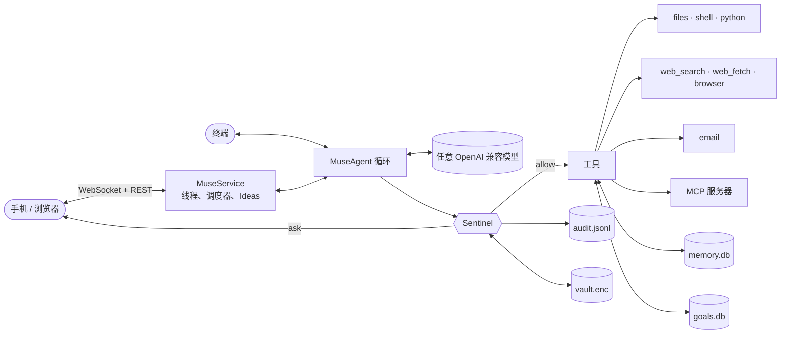

<p align="center">
  
</p>

<h1 align="center">OpenMuse</h1>

<p align="center">
  Meta <a href="https://about.fb.com/news/2026/09/introducing-muse-personal-ai-agent/">Muse</a> 的开源实现：一个在手机上替你做事的个人 Agent，关掉 App 也会继续干活，做任何不可撤销的事之前先问你。自托管，模型任选。
</p>

<p align="center">
  <a href="https://github.com/OpenMuseAgent/OpenMuse/actions/workflows/ci.yml"></a>
  <a href="https://pypi.org/project/openmuse/"></a>
  <a href="LICENSE"></a>
  
  <br>
  <a href="README.md">English</a> · 简体中文
</p>

<p align="center">
  
  
  
  
</p>

## 从这里开始

| 你想… | 看这里 |
|---|---|
| 安装并在手机上打开 | [安装](#安装) → [快速开始](#快速开始) |
| 在终端里用 | [CLI](docs/cli.md) |
| 接 DeepSeek、OpenAI、Ollama 或公司网关 | [模型](#模型) · [配置](docs/configuration.md) |
| 搞清楚它什么会直接做、什么会先问 | [Sentinel](#sentinel) · [docs/sentinel.md](docs/sentinel.md) |
| 接邮箱、浏览器或 MCP 服务器 | [配置 → Connectors](docs/configuration.md#connectors) |
| 读代码 | [架构](#架构) · [docs/architecture.md](docs/architecture.md) |
| 用 Docker 跑 | [部署](docs/deployment.md) |

## 它能做什么

Meta 的 Muse 不是聊天机器人，而是一个动手的 Agent：查资料、做计划、写文件、发邮件、花几周推进一个目标，而每个有风险的动作都要经过一个独立的守门人。OpenMuse 把这套东西在开源世界里重做了一遍：

- 一条和你的 Agent 之间的长对话，外加处理独立任务的侧边聊天。工具调用以内联小块展示，点开可看参数和输出。
- 审批卡片。任何难以撤销的事（一条 shell 命令、一封邮件、读过私密数据之后的网络请求）都会停下来等你点一下：拒绝、允许一次、本次会话允许、始终允许。
- 比对话活得更久的目标。Agent 把目标拆成步骤，边做边更新，还能在 App 关闭时按定时器继续推进，并把进展发到主聊天里。
- Ideas：基于你的目标、记忆和近期对话给出的下一步建议。
- 你能看、能改的记忆。Agent 记下的关于你的长期事实在页签里一览无余，点一下就能让它忘掉。
- Sentinel 守门人、凭据保险库、污点追踪和只追加的审计日志。见 [Sentinel](#sentinel)。
- 工具：文件、shell、Python、网页搜索与抓取、邮件（一次性验证码在模型看到之前就被抹掉）、可选的 Playwright 浏览器，以及任何 [MCP](https://modelcontextprotocol.io) 服务器。
- 任何 OpenAI 兼容模型都能跑：DeepSeek、OpenAI、OpenRouter、Ollama、vLLM，或者带自定义请求头的公司网关。

## 为什么是 OpenMuse

- **它是一个 Muse，不是 bot 框架。** 一个有名字有头像的 Agent，一个带 Chat / Goals / Ideas / Memory 页签的手机 App，审批卡片，后台干活。如果你想要的是 Telegram 或 Discord 里的机器人，看看[相关项目](#相关项目)。
- **安全是架构，不是一个开关。** Agent 从不直接碰工具。独立的 `Sentinel` 对每次调用裁决 allow / ask / deny，在执行前替换 `{{vault:NAME}}` 占位符（密钥不进模型），追踪污点（读过私密数据后，新的网络目的地需要审批），并记录一切。
- **模型自带。** Chat Completions 或 Responses API，流式输出，`<think>` 处理，原生或基于提示词的工具调用。
- **小到能读完。** 约 7k 行带类型标注的 Python 和 3k 行 TypeScript，底下没有编排框架。

## 安装

需要 Python 3.11 或更新。手机 App 已预先构建并打进包里，只有改 `web/` 时才需要 Node。

```bash
uv tool install openmuse
# 或：pip install openmuse
```

要最新的 git 版本：`uv tool install git+https://github.com/OpenMuseAgent/OpenMuse.git`。从源码开发：

```bash
git clone https://github.com/OpenMuseAgent/OpenMuse.git && cd OpenMuse
uv venv && source .venv/bin/activate
uv pip install -e ".[dev]"
```

可选：`openmuse[browser]` 增加 Playwright 浏览器工具（然后 `playwright install chromium`）。

## 快速开始

```bash
openmuse config init                 # 生成 config/config.toml
export DEEPSEEK_API_KEY=sk-...       # 默认配置用 DeepSeek，其他见下方“模型”
openmuse serve --host 0.0.0.0        # 打印链接和二维码
```

用手机扫码（同一 Wi-Fi），或在本机打开链接。链接里带一次性访问令牌；把页面添加到主屏幕，它就像一个 App。然后试试：

- *“对比 Sony WH-1000XM6 和 Bose QuietComfort Ultra 哪个更适合长途飞行，把简短对比写到 headphones.md”*
- *“看看这台机器还有多少磁盘空间”*——这一条会弹出审批卡片。
- *“建一个目标：12 月去京都之前学会日常日语对话，每天 30 分钟”*——然后打开 Goals 页签。

更习惯终端？`openmuse chat` 给你同一个 Agent，审批在控制台里完成；`openmuse run "任务"` 跑一件事就退出。见 [docs/cli.md](docs/cli.md)。

## App

`openmuse serve` 启动一个常驻的 Agent，并在同一个进程里提供移动端优先的 Web App（FastAPI + WebSocket 推送实时事件；客户端是 React，打进 Python 包里）。

<p align="center">
  
  
  
  
</p>

| 页面 | 内容 |
|---|---|
| Chat | 消息式对话、流式回复、可展开的工具小块、文件产物、审批与提问卡片、侧边聊天。Agent 干活时你可以继续输入，新消息会并入正在进行的这一轮。 |
| Goals | 进行中 / 暂停 / 完成的目标，含步骤状态与备注的计划，“现在推进”，以及一个“我不在时每 N 分钟继续推进目标”的开关。 |
| Ideas | 五条建议，按需重新生成。点一下就作为消息发出。 |
| Memory | Agent 记住的关于你的一切，按类别分组。可添加、可遗忘。 |
| You | Agent 的名字、头像、颜色和性格；Sentinel 模式；后台工作；回复语言。 |
| 头像 | 点一下打开活动记录：审计日志里的每次工具调用、裁决与审批。 |

App 走一套很小的 REST + WebSocket API，见 [docs/app.md](docs/app.md)，其他前端可以基于同一个服务端构建。

## Sentinel

每次工具调用在执行前都要经过 `Sentinel`。工具声明风险等级（`safe` / `moderate` / `sensitive`），并可对特定调用升级（`shell` 遇到 `rm -rf`，`web_fetch` 遇到内网 IP）。裁决顺序，首个匹配生效：

1. `deny_tools` → 拒绝
2. 对参数做 glob 匹配的 `[[sentinel.rules]]` → 规则指定的动作
3. `always_allow_tools` / `always_ask_tools`
4. 污点：本会话读过私密数据（邮件、记忆、工作区外文件）**且**本次调用向 `egress_allowlist` 之外的主机发送数据 → 询问
5. 风险 × 模式：`ask` 对 sensitive 询问，`strict` 对 moderate 也询问，`auto` 放行一切未被拒绝的调用

```toml
[sentinel]
mode = "ask"                              # ask | strict | auto
always_ask_tools = ["send_email", "shell"]
egress_allowlist = ["*.wikipedia.org", "github.com", "*.github.com"]

[[sentinel.rules]]
tool   = "shell"
match  = { command = "*rm -rf*" }
action = "deny"
```

密钥存在 Fernet 加密的保险库里（`openmuse vault set EMAIL_PASSWORD`）。配置和工具参数用 `{{vault:EMAIL_PASSWORD}}` 引用；Sentinel 在执行前一刻替换真实值，并在工具输出里把它脱敏，模型始终看不到。每次裁决都追加到 `~/.openmuse/audit.jsonl`。细节见 [docs/sentinel.md](docs/sentinel.md)。

## 模型

编辑 `config/config.toml` 里的 `[llm]`，任何 OpenAI 兼容接口都行：

```toml
[llm]
provider = "openai"                    # Chat Completions；Responses API 用 "openai_responses"
model    = "deepseek-flash"
base_url = "https://api.deepseek.com"
api_key  = "${DEEPSEEK_API_KEY}"

# OpenAI:      model = "gpt-5.6-sol"  base_url = "https://api.openai.com/v1"   api_key = "${OPENAI_API_KEY}"
# Ollama:      model = "qwen3:32b"    base_url = "http://localhost:11434/v1"   api_key = "ollama"
# OpenRouter:  model = "deepseek/deepseek-flash"  base_url = "https://openrouter.ai/api/v1"
# 需要自定义请求头的网关：  extra_headers = { "X-End-User-Id" = "openmuse" }
# 忽略 `tools` 字段的模型：  tool_mode = "prompt"
```

同样的设置也可以用 `OPENMUSE_LLM_MODEL`、`OPENMUSE_LLM_BASE_URL`、`OPENMUSE_LLM_API_KEY`、`OPENMUSE_LLM_PROVIDER` 覆盖。完整参考：[docs/configuration.md](docs/configuration.md)。

## 架构



| 模块 | 文件 |
|---|---|
| Agent 循环、系统提示、上下文窗口 | `openmuse/agent/core.py`、`openmuse/prompts.py` |
| Sentinel：策略、审批、污点、审计 | `openmuse/sentinel/` |
| 凭据保险库 | `openmuse/vault/` |
| 工具与 MCP 适配 | `openmuse/tools/` |
| LLM 提供方、`<think>` 过滤、提示词工具调用 | `openmuse/llm/` |
| 记忆与目标（SQLite） | `openmuse/memory/`、`openmuse/goals/` |
| App 服务端：服务、REST/WebSocket API、时间线 | `openmuse/server/` |
| 手机 App（React、Vite、Tailwind） | `web/` → 构建到 `openmuse/server/static/` |
| 终端 UI 与 CLI | `openmuse/console.py`、`openmuse/cli.py` |

更多见 [docs/architecture.md](docs/architecture.md)。

## OpenMuse 与 Meta Muse

| Meta Muse | OpenMuse |
|---|---|
| 每个用户一台 Secure VM | 跑在你的机器或 Docker 里；工作区和数据目录就是边界 |
| Sentinel 审批敏感动作 | `Sentinel` 策略引擎：allow / ask / deny、规则、污点追踪、出站白名单 |
| 凭据不进模型 | 加密保险库 + `{{vault:NAME}}` 占位符 + 输出脱敏 |
| 记得你 | Agent 维护、你可编辑的 SQLite 记忆 |
| 后台推进目标 | 带步骤的目标；调度器推进并向聊天汇报 |
| 带聊天、目标、审批的手机 App | `openmuse serve` 提供的移动端优先 Web App，可添加到主屏幕 |
| Meta 自家模型 | 任意 OpenAI 兼容模型 |
| 闭源 | MIT |

## 文档

- [配置](docs/configuration.md)：所有设置、环境变量覆盖、连接器、MCP
- [Sentinel](docs/sentinel.md)：裁决顺序、规则、污点追踪、保险库、审计
- [App 与 API](docs/app.md)：手机访问、令牌、线程、审批、接口
- [CLI](docs/cli.md)：`chat`、`run`、`serve`、`daemon`、`goals`、`memory`、`vault`、`audit`、`config`
- [架构](docs/architecture.md)：源码地图与扩展点
- [部署](docs/deployment.md)：Docker、Compose、常驻运行
- [排障](docs/troubleshooting.md)

## 路线图

- [x] Agent 循环、Sentinel、保险库、审计、记忆、目标、工具、MCP、CLI
- [x] 移动端优先 App：聊天、审批卡片、侧边聊天、Goals / Ideas / Memory、后台推进目标
- [ ] 有审批等待或目标有进展时的推送通知
- [ ] 目标触发器：cron、webhook、新邮件
- [ ] 日历与联系人连接器（通过 MCP）
- [ ] 更好的记忆召回（向量）与定期整理
- [ ] `shell` 与 `python_execute` 的独立沙箱
- [ ] Skills：可复用的任务配方

## 参与

拿它做一件真事，报告哪里坏了，然后挑一个具体的点改进。开发环境见 [CONTRIBUTING.md](CONTRIBUTING.md)；CI 跑 `ruff`、`pytest` 和前端构建。

## 相关项目

- [nanobot](https://github.com/HKUDS/nanobot)：一个轻量的个人助手框架，活在聊天软件里（Telegram、Discord、Slack、微信……）。想在已有的频道里放一个 bot，选它。OpenMuse 是一个按 Muse 的产品形态和安全模型做的单一 Agent，不打算做频道框架。
- [OpenClaw](https://github.com/openclaw/openclaw)：很多助手项目沿用的常驻网关思路。
- [browser-use](https://github.com/browser-use/browser-use)：浏览器工具里元素标注的做法来自这里。
- [Model Context Protocol](https://modelcontextprotocol.io)：OpenMuse 不用逐个写连接器的原因。

## 声明

OpenMuse 是独立的社区项目，与 Meta Platforms, Inc. 及其 Muse 产品无关，未获其认可，也不派生自它们。

## 许可证

[MIT](LICENSE)
