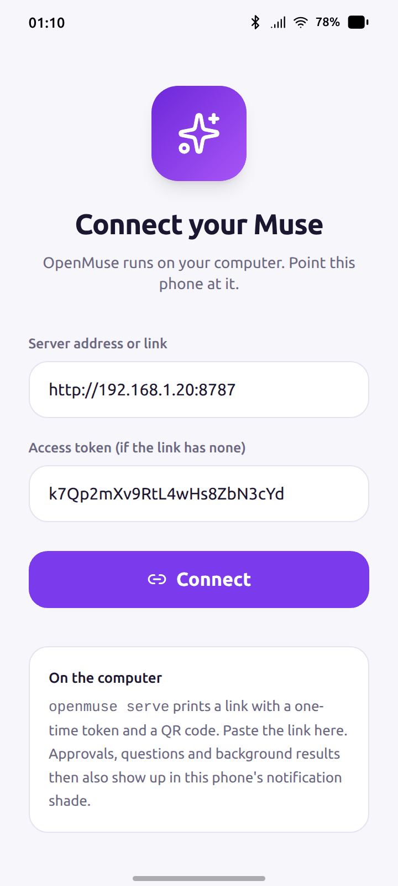
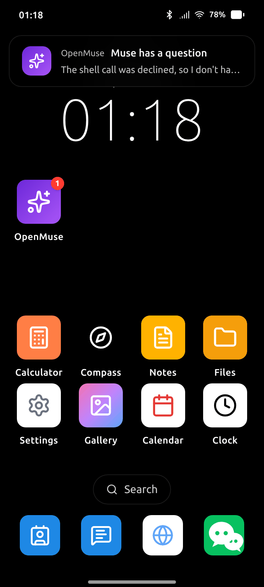
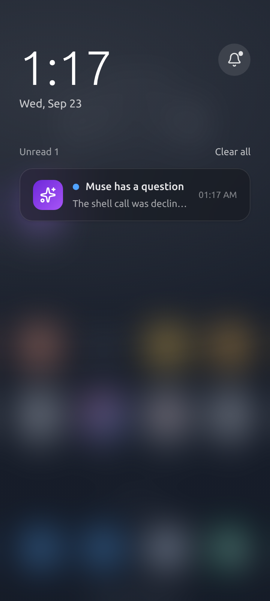
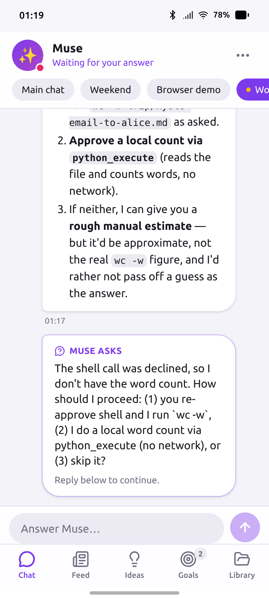

# OpenMuse as an app on a simulated phone

Muse lives on a phone: it sits among your other apps, and when it needs you — an approval, a
question, something it finished in the background — it comes through the notification shade.
This directory makes OpenMuse behave that way inside [MobileGym](https://github.com/Purewhiter/mobilegym),
a browser-hosted Android simulator with a launcher, a notification shade and 28 re-implemented
apps (WeChat, Alipay, 12306, …). No device, no emulator: one browser tab.

<p align="center">
  
  
  
  
</p>

`apps/OpenMuse/` is an app module in MobileGym's own format (manifest, entry component,
navigation declaration, Zustand store — see the platform's app module contract). It is a thin
shell around the real OpenMuse web app:

- **The app** shows the OpenMuse web app full screen, served by `openmuse serve` on your
  computer. Everything you see is the same code a real phone gets; the shell only keeps the
  tab bar clear of the simulator's gesture bar.
- **Notifications** — real phones get Web Push. The simulator has no push service, so the
  module keeps one WebSocket to the server open for the whole simulator session (the store is
  loaded at boot, before any app is opened) and turns the events a phone would be notified
  about into simulated Android notifications: *Muse needs your approval*, *Muse has a
  question*, and the last word of a background pass or check-in. Tapping one opens OpenMuse
  on that chat. A card you decide from another device takes its notification down again; the
  launcher icon carries the unread badge.
- **Setup** — on first launch the app asks for the server address; paste the link
  `openmuse serve` prints (it carries the access token). The token is checked by opening the
  server's WebSocket once, so the server needs no CORS configuration.

For the lighter variant — OpenMuse opened in the simulator's Browser app, nothing installed —
see [docs/demo-mobilegym.md](../../docs/demo-mobilegym.md).

## Run it

Node 22+, Python 3.11+, a Chromium-based desktop browser. MobileGym's 1.9 GB companion
dataset is optional here: OpenMuse does not need it, the simulated media apps just render empty
without it.

```bash
# 1. OpenMuse, as usual — prints a link with a one-time token
openmuse serve --port 8787

# 2. MobileGym with the OpenMuse app installed
git clone --depth 1 https://github.com/Purewhiter/mobilegym.git
demo/mobilegym/install.sh mobilegym          # copies apps/OpenMuse into the checkout
cd mobilegym && npm install && npm run dev   # http://127.0.0.1:3000
```

Open the simulator, find **OpenMuse** in the launcher (search works too), paste the link from
step 1, *Connect*. Then go back to the home screen and give the agent something to do from
another tab or the CLI — `openmuse chat`, or the web app in a normal browser tab: the phone
lights up when it needs you.

`install.sh` only copies files; MobileGym discovers apps by directory convention, nothing in the
checkout is edited. Run it again after pulling a newer OpenMuse.

## Notes

- **Origin.** The web app runs cross-origin inside an `<iframe>` (`127.0.0.1:8787` inside
  `127.0.0.1:3000`). That is fine for using it; it only means the outer page cannot script the
  inner one, which is the point of an iframe.
- **Dark mode.** The web app inside the frame follows the browser's colour scheme (it cannot
  see the simulator's); the setup page follows the simulator's.
- **Deep links.** The OS hands the app `/?thread=<id>`; the shell forwards `thread` and `tab`
  to the web app's own deep links (`docs/app.md`).
- **Not a MobileGym benchmark task.** The module declares its UI states and transitions like
  every MobileGym app, so the platform's analyzer sees it, but OpenMuse's content is live
  server output and is not deterministic — it is here to show the product, not to be graded.

## Layout

```
apps/OpenMuse/
├── manifest.ts               id, names, icon, theme, splash
├── OpenMuseApp.tsx           entry: router, theme vars, back handling, deep links
├── navigation.declaration.ts routes (/ and /setup), transitions, UI states
├── navigation.ts             go()/back() over the declaration
├── navigation.types.ts       re-exports the platform's shared types
├── state.ts                  Zustand store: server URL, token, notify switch; wires the bridge
├── bridge.ts                 WebSocket → NotificationService
├── pages/MusePage.tsx        the web app, full screen
├── pages/SetupPage.tsx       server address and token
├── hooks/useOpenMuseGestures.ts
├── data/                     defaults
└── res/icons.tsx
```
